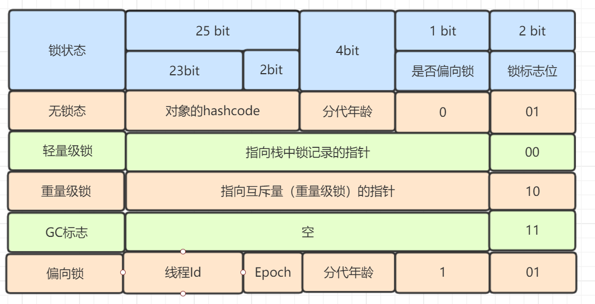
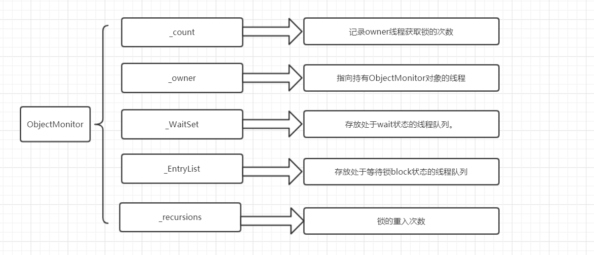

### synchronized

#### 锁的分类

* 自旋锁
* 悲观锁、乐观锁
* 共享锁、排它锁
* 可重入锁、不可重入锁
* 公平锁、非公平锁
* 类锁、对象锁

synchronized属于悲观锁、排它锁、可重入锁

#### synchronized特性

* 同步
* 保证可见性

#### synchronized使用

* synchronized同步实例方法
* synchronized同步静态方法
* synchronized同步代码块

对应实现如下:

* synchronized代码块: `monitorenter`、`monitorexit`
* synchronized方法: `ACC_SYNCHRONIZED`，方法进入加锁，方法返回或异常退出解锁

#### 对象头

> synchronized依赖于对象头

* 无锁: 偏向锁标识0 + 锁标识`01`
* 偏向锁: 线程ID + Epoch(重入次数) + 偏向锁标识1 + 锁标识`01`
* 轻量级锁: 指向轻量级锁记录的指针 + 锁标识`00`
* 重量级锁: 指向重量级锁记录的指针 + 锁标识`10`

(80%)

#### 偏向锁

> 在无锁竞争的情况下，对象头中存储当前持有锁的线程ID，出现锁竞争后，偏向锁撤销，升级为轻量级锁

CAS `Thread Id`，适用于只有一个线程访问同步块的场景，锁偏向于第一个获得它的线程

#### 轻量级锁

> 竞争锁的线程在当前线程的栈帧中创建存储锁记录的空间，将对象头的Mark Word复制到锁记录中，然后尝试CAS替换对象头的Mark Word为指向锁记录的指针，成功则获得锁，失败则使用自旋锁

CAS `Mark Word`，适用于线程交替执行同步块的场景，同步块执行速度非常快，不存在锁竞争

#### 自旋锁

> 轻量级锁失败，先进行自旋尝试，不成功再升级为重量级锁

CAS自旋

#### 重量级锁

> 重量级锁，即对象监视器锁，对象头中锁记录的指针指向监视器锁

#### 监视器锁Monitor

监视器锁的数据结构:

(60%)

监视器锁的工作原理:

* monitorenter: 获取锁的线程进入`_EntryList队列`
    * `_owner`为null时，从`_EntryList队列`中选取一个线程获取锁，然后运行该线程
    * `_owner`不为null时，阻塞等待
* monitorexit: 线程释放锁，`_owner`置为null
* wait: 线程释放锁，`_owner`置为null，进入`_WaitSet队列`，等待被唤醒
* notify: 唤醒`_WaitSet队列`中指定线程，加入`_EntryList队列`，重新竞争锁
* notifyAll: 唤醒`_WaitSet队列`中所有线程，，加入`_EntryList队列`，重新竞争锁
