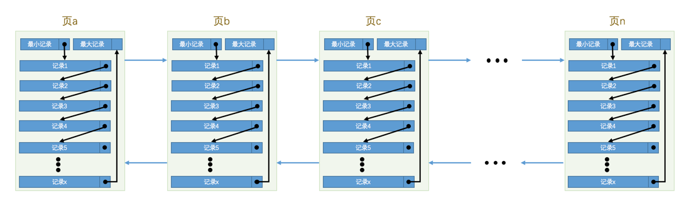

### InnoDB

#### InnoDB行格式

InnoDB有四种行格式:

* Compact
* Redundant
* Dynamic
* Compressed

##### Compact行格式

(80%)

```sql
> create table record_compact(
    id int(11) not null auto_increment primary key,
    c1 char(10),
    c2 varchar(10),
    c3 varchar(10) not null,
    c4 varchar(10)
) ENGINE=InnoDB CHARSET=ascii ROW_FORMAT=COMPACT;
> insert into record_compact(c1, c2, c3, c4) values
    ('a', 'bb', 'ccc', 'ddd'),
    (null, 'e', 'ff', null);
> select * from record_compact;
+----+------+------+-----+------+
| id | c1   | c2   | c3  | c4   |
+----+------+------+-----+------+
|  1 | a    | bb   | ccc | ddd  |
|  2 | NULL | e    | ff  | NULL |
+----+------+------+-----+------+
```

* 变长字段长度列表

> 存放变长字段的长度，变长字段包括varchar、text、blob，逆序存放，只存放`非NULL`的列的长度

```console
04 03 02    // id=1(c4、c3、c2)
02 01       // id=2(c3、c2)
```

> `注:`
>
> char列的字符集为变长字符集时，对应char列的长度也会被加到变长字段长度列表中

* NULL值列表

> 存放允许为NULL的列的NULL标识，每个允许为NULL的列对应一个二进制位，二进制位为1代表该列为NULL，二进制位逆序排列

record_compact表有三个允许为NULL的列，c1、c2、c4

```console
00          // id=1(0000 0000)
05          // id=2(0000 0101)
```

* 记录头信息

5字节

* 列数据

> 列数据包括隐藏列和表中定义的列

**隐藏列:**

* DB_ROW_ID: 行id，主键id
* DB_TRX_ID: 事务id
* DB_ROLL_PTR: 回滚指针

**表中定义的列:**

```console
// id=1
61 20 20 20 20 20 20 20 20 20   // char长度不够用空格填充
62 62
63 63 63
64 64 64 64

// id=2
65
66 66
```

**VARCHAR(M)最多能存储的数据**

```sql
> create table varchar_size_test_1(
    c varchar(65533) not null
) engine=InnoDB charset=ascii row_format=compact;
ERROR 1118 (42000): Row size too large. The maximum row size for the used table type, not counting BLOBs, is 65535.
This includes storage overhead, check the manual. You have to change some columns to TEXT or BLOBs
```

> `注:`
>
> 一个行中所有列(不包括隐藏列和记录头信息)占用的字节数的和不能超过65535个字节，包括`变长字段长度列表`、`NULL值列表`和`真实数据`占用的字节数

```sql
# 变长字段长度列表2字节 + NULL值列表1字节 + 真实数据65532字节 = 65535
> create table varchar_size_test_2(
    c varchar(65532)
) engine=InnoDB charset=ascii row_format=compact;

# 变长字段长度列表2字节 + 真实数据65533字节 = 65535
> create table varchar_size_test_3(
    c varchar(65533) not null
) engine=InnoDB charset=ascii row_format=compact;

# 变长字段长度列表2字节 + 真实数据65532字节(21844 * 2) = 65534
> create table varchar_size_test_4(
      c varchar(21844) not null
  ) engine=InnoDB charset=utf8 row_format=compact;
```

**行溢出**

> MySQL中规定一个页中至少存放两行记录，如果某一列中的数据非常多，在本记录的真实数据处只会存储该列的前768个字节的数据和一个指向其他页的地址

##### Dynamic行格式和Compressed行格式

> Dynamic行格式是MySQL默认的行格式，同Compact行格式，在处理行溢出数据时，把所有的字节都存储到其他页中，只在记录的真实数据处存储其他页的地址
>
> Compressed行格式同Dynamic行格式，不过会采用压缩算法对页进行压缩

#### InnoDB数据页

InnoDB中页的大小为`16k`

**数据页组成:**

* File Header: 文件头
* Page Header: 页头
* Infimum + Supremum: 最小记录和最大记录
* User Records: 用户记录
* Free Space: 空闲空间
* Page Directory: 页目录
* File Trailer: 文件尾

##### 用户记录(User Records)

* 最小记录: Infimum记录
* 最大记录: Supremum记录
* 真实数据记录: 记录之间通过`next_record`按照主键从小到大组成一个单向链表

(80%)

* insert
* 删除记录: 记录的`delete_mask`设为1，上一条记录的`next_record`指向下一条记录

##### 页目录(Page Directory)

* 槽(Slot)，分组
    * `n_owned`: 分组内的记录数
* 主键查找
    * 二分法查找定位槽
    * 通过`next_record`遍历槽对应分组中的记录

> `注`: InnoDB规定，对于最小记录所在的分组只能有`1`条记录，最大记录所在的分组拥有的记录条数只能在`1~8`条之间，剩下的分组中记录的条数范围只能在是`4~8`条之间

(80%)

##### 文件头部(File Header)

页之间通过上一页`FIL_PAGE_PREV`和下一页`FIL_PAGE_NEXT`组成一个双向链表

(80%)

(80%)

#### 索引

(80%)

(80%)

##### 目录项记录

> 目录项记录只存储主键值和对应的页号

**B+树:**

* 根节点
* 非叶子节点
* 叶子节点

(80%)

> 一般情况下，我们用到的B+树都不会超过4层

##### 聚簇索引

##### 二级索引

> 二级索引的目录项记录存储的是`二级索引列 + 主键 + 页号`的值
>
> 二级索引的叶子节点存储的是`二级索引列 + 主键`的值

> `注:` MyISAM的索引全部是二级索引，包括主键索引

**二级索引查找:**

* 二级索引查找主键值
* 主键索引查找完整的用户记录(回表)

##### 联合索引

> 以多个列的大小作为排序规则建立索引
>
> 联合索引的目录项记录存储的是`多个列 + 主键 + 页号`的值
>
> 联合索引的叶子节点存储的是`多个列 + 主键`的值

##### 前缀索引

> 使用列的前缀代替整个列作为前缀

```sql
alter table table_name add index `name` (name(8));
```

##### 索引查找

* **全列匹配:** where子句中的列和索引列一致，例如，联合索引(index_field_1, index_field_2, index_field_3)

```sql
select * from table_name where index_field_1 = 'value1' and index_field_2 = 'value2' and index_field_3 = 'value3'
```

* **最左匹配:** where子句中的列只包含联合索引左边的列，例如，联合索引(index_field_1, index_field_2, index_field_3)

```sql
select * from table_name where index_field_1 = 'value1' and index_field_2 = 'value2'
```

* **列前缀匹配:** 字符串前缀模糊匹配

```sql
select * from table_name where name like 'as%';
```

* **范围匹配:** 索引列的值在某个范围内

```sql
select * from table_name where id > 1000 and id < 10000;
```

> `注:` 对联合索引中的多个列进行范围查找时，只有联合索引最左边范围查找的列可以用到索引

```sql
select * from table_name where index_field_1 = 'range1' > and index_field_1 < 'range2';
select * from table_name where index_field_1 = 'value1' and index_field_2 = 'range1' > and index_field_2 < 'range2';
```

##### 索引排序

> 利用索引列的有序性进行排序，避免内存或磁盘上的文件排序`filesort`

```sql
select * from table_name order by index_field_1 limit 10;
select * from table_name order by index_field_1, index_field_2 limit 10;
select * from table_name where index_field_1 = 'value1' order by index_field_2, index_field_3 limit 10;
```

不能使用索引进行排序的情况:

* `ASC`、`DESC`混用时

```sql
select * from table_name order by index_field_1 asc, index_field_2 desc limit 10;
```

* where子句中出现非排序使用到的索引列

```sql
select * from table_name where field_other = 'value' order by index_field_1 limit 10;
```

* 排序列包含非同一个索引的列

```sql
select * from table_name order by index_field_1, field_other limit 10;
```

* 排序列使用了复杂的表达式

```sql
select * from table_name order by upper(index_field_1) limit 10;
```

##### 索引分组

> 同`索引排序`，索引也可以用来分组

```sql
select index_field_1, index_field_2, count(1) from table_name group by index_field_1, index_field_2;
```

##### 回表

> 二级索引列中不包含完整的查询列，需要用二级索引中的主键id到聚簇索引中查找完整的用户记录(`回表`)

* 二级索引: `顺序IO`
* 回表: 离散主键id -&gt; `随机IO` -&gt; 主键索引

> `注:` `离散主键id`越多，需要回表的记录就越多，使用二级索引的性能就越低

##### 覆盖索引

> 索引列中包含全部的查询列，不需要回表操作

```sql
select index_field_1, index_field_2 where index_field_1 = 'value';
```

##### 主键插入顺序

* 自增主键或递增主键
    * 数据页未满，`User Records连续插入
    * 数据页已满，申请新的数据页继续插入
    : 插入时一个数据页一个数据页的插入，单数据页内连续插入
* 离散主键(`包括所有的非聚集索引`)
    * 索引所在的数据页分散，查找索引所在的数据页
    * 索引页未满，记录移位
    * 索引页已满，页面分裂

##### 索引注意事项

* 只为用于搜索、排序或分组的列创建索引: where、join、order by、group by子句中出现的列
* 考虑列的基数: 建立索引列的基数必须足够大，否则会导致大量的回表操作
* 索引列的类型尽量小: 可以加快索引的比较操作，同时索引占用的存储空间越少，一个数据页中就可以存放更多的索引项记录，可以更好的利用数据页缓存和减少磁盘I/O
* 索引字符串值的前缀: 只对字符串的前几个字符进行索引，但此时不支持索引排序
* 索引列在比较表达式中不是以单独列的形式出现，而是以表达式、函数调用的形式出现的话，是用不到索引的
* 不要创建冗余和重复索引
* 不要创建太多的索引，索引会占用一定的存储空间，同时会导致插入和更新变慢

##### 适合建索引的情况

* 全值匹配
* 最左匹配
* 范围匹配
* 精确匹配某一列并范围匹配另外一列
* 用于排序
* 用于分组

#### Buffer Pool

> 缓冲池，在内存中缓存磁盘中的页

**缓冲池大小:**

```sql
> show variables like 'innodb_buffer_pool_size';
+-------------------------+-----------+
| Variable_name           | Value     |
+-------------------------+-----------+
| innodb_buffer_pool_size | 134217728 |
+-------------------------+-----------+
```

缓冲池由控制块和缓存页组成，每个页对应的控制信息占用的一块内存称为一个控制块，控制块和缓存页是一一对应的，缓存页的大小和磁盘上页的大小是一样的，默认都是16k

(80%)

##### free链表

> 所有空闲的缓存页对应的控制块组成的一个链表，也称为空闲链表

MySQL启动时完成初始化的Buffer Pool中所有的缓存页都是空闲的，每一个缓存页对应的控制块都会被加入到free链表中

(80%)

从磁盘中加载一个页到Buffer Pool中时，从`free链表`中取出一个空闲的缓存页填充(填充缓存页，同步控制块)，然后把该缓存页从`free链表`中移除，表示该缓存页已经被使用了

##### 缓存页的哈希表

> 如何快速定位某个页在不在Buffer Pool中？

答案是`哈希表`，`表空间号 + 页号`为`key`，`缓存页`为value

查询的时候，先通过索引定位到对应的数据页，然后查找`哈希表`判断数据页是否在缓冲池中

##### flush链表

> 修改后未刷新到磁盘的缓存页(`脏页`)对应的控制块组成的一个链表

(80%)

##### LRU链表

> Buffer Pool满了，free链表中没有多余的空闲缓存页时，怎么办？

答案是`LRU链表`，`LRU链表`按照`最近最少使用`的原则去淘汰缓存页

**LRU链表的特点:**

* LRU链表按`一定比例`分成两部分，young区域和old区域，young区域(`热数据`)存储使用频率非常高的缓存页，old区域(`冷数据`)存储使用频率不是很高的缓存页，划分的比例由系统变量`innodb_old_blocks_pct`来控制，`innodb_old_blocks_pct`代表old区域在LRU链表中所占的比例

```sql
> show variables like 'innodb_old_blocks_pct';
+-----------------------+-------+
| Variable_name         | Value |
+-----------------------+-------+
| innodb_old_blocks_pct | 37    |
+-----------------------+-------+
```

(80%)

* 访问某个页面，该页面已经缓存在Buffer Pool中，则直接把该页对应的控制块移动到`young区域的头部`
* Buffer Pool中，free链表中没有多余的空闲缓存页时，从`old区域的尾部`淘汰缓存页
* 磁盘上的某个页面在`初次`加载到Buffer Pool中的某个缓存页时，该缓存页对应的控制块会被放到`old区域的头部`，针对`预读`的优化，提高缓存命中率
* 在对某个处在old区域的缓存页进行`第一次访问`时就在它对应的控制块中记录下来这个访问时间，如果后续的访问时间与第一次访问的时间在某个时间间隔内，那么该页面就不会被从old区域移动到young区域的头部，否则将它移动到young区域的头部，这个间隔时间由系统变量`innodb_old_blocks_time`控制，默认为1s，针对`全表扫描`的优化，提高缓存命中率

##### 刷新脏页到磁盘

> 后台有专门的线程每隔一段时间负责把`脏页刷新到磁盘`，这样可以不影响用户线程处理正常的请求

脏页刷新到磁盘有两种路径:

* `BUF_FLUSH_LRU`，从`LRU链表的冷数据`中刷新一部分页面到磁盘，后台线程定时从LRU链表尾部开始扫描一些页面，扫描的页面数量由系统变量`innodb_lru_scan_depth`来控制，如果发现脏页，则刷新脏页到磁盘

```sql
> show variables like 'innodb_lru_scan_depth';
+-----------------------+-------+
| Variable_name         | Value |
+-----------------------+-------+
| innodb_lru_scan_depth | 1024  |
+-----------------------+-------+
```

* `BUF_FLUSH_LIST`，从`flush链表`中刷新一部分页面到磁盘，后台线程定时从flush链表中刷新一部分页面到磁盘，刷新的速率取决于当时系统是不是很繁忙
* `BUF_FLUSH_SINGLE_PAGE`，后台线程刷新脏页的进度比较慢，并且`old区域的尾部`没有可以直接释放掉的未修改页面，则不得不将`old区域的尾部`的一个脏页同步刷新到磁盘

##### 多个Buffer Pool实例

> 在Buffer Pool特别大的时候，可以将Buffer Pool拆分为若干个小的Buffer Pool，每个Buffer Pool都是独立的

##### Buffer Pool状态信息

查看InnoDB中`Buffer Pool`的状态信息:

```sql
> show engine innodb status\G;
----------------------
BUFFER POOL AND MEMORY
----------------------
Total large memory allocated 1099431936
Dictionary memory allocated 7300777
Buffer pool size   65528
Free buffers       32004
Database pages     34627
Old database pages 12618
Modified db pages  0
Pending reads      0
Pending writes: LRU 0, flush list 0, single page 0
Pages made young 1373352, not young 60455298
0.00 youngs/s, 0.00 non-youngs/s
Pages read 10175174, created 1822107, written 219721377
0.00 reads/s, 0.00 creates/s, 9.75 writes/s
Buffer pool hit rate 1000 / 1000, young-making rate 0 / 1000 not 0 / 1000
Pages read ahead 0.00/s, evicted without access 0.00/s, Random read ahead 0.00/s
LRU len: 34627, unzip_LRU len: 3063
I/O sum[3824]:cur[0], unzip sum[0]:cur[0]
----------------------
```

* `Buffer pool size`: Buffer Pool中可以容纳的缓存页的数量
* `Free buffers`: free链表的节点数
* `Database pages`: LRU链表的节点数
* `Old database pages`: LRU链表old区域的节点数
* `Modified db pages`: 脏页的数量，即flush链表的节点数

#### 事务

##### ACID

> ACID是数据库事务的四个特性

* A: 原子性，Atomicity，一个事务中的所有操作，要么全部执行，要么全部不执行，不会停留在某个中间状态，允许回滚
    * commit: redo log
    * rollback: undo log
* C: 一致性，Consistency，事务从一个一致性状态切换到另一个一致性状态，事务的中间状态不会被其它事务看到
    * 锁、MVCC、doublewrite buffer
* I: 隔离性，Isolation，事务之间互相影响的程度，适当的破坏`一致性`来提升并发度
    * 锁、MVCC
* D: 持久性，Durability，事务提交后，数据会被持久化到数据库，不会丢失
    * redo log、doublewrite buffer
    * `innodb_flush_log_at_trx_commit`
    * `sync_binlog`

#### redo log(重做日志)

> redo日志会把事务在执行过程中对数据库所做的所有修改都记录下来，记录的是对某个数据页的物理操作，在系统崩溃重启后可以把事务所做的任何修改都恢复出来

redo日志的优点:

* redo日志占用的存储空间非常小，redo日志只包含表空间id、页号、偏移量、更新的值等数据
* redo日志是顺序写入磁盘的，顺序IO效率比较高

##### redo日志缓冲区

> redo log buffer，重做日志缓冲区，写入redo日志时不直接写到磁盘上，而是先写到内存中的redo日志缓冲区

redo log buffer的大小由系统变量`innodb_log_buffer_size`控制，默认大小为16M

```sql
> show variables like 'innodb_log_buffer_size';
+------------------------+----------+
| Variable_name          | Value    |
+------------------------+----------+
| innodb_log_buffer_size | 16777216 |
+------------------------+----------+
```

##### redo日志文件组

> redo日志先写到redo log buffer中，然后再从redo log buffer刷新到磁盘的redo日志文件中

MySQL数据目录下`ib_logfile0`和`ib_logfile1`两个磁盘文件就是redo日志文件，所有的redo日志文件组成一个`redo日志文件组`

```sql
> show variables like 'innodb_log_file%';
+---------------------------+----------+
| Variable_name             | Value    |
+---------------------------+----------+
| innodb_log_file_size      | 50331648 |
| innodb_log_files_in_group | 2        |
+---------------------------+----------+
```

* `innodb_log_file_size`: 每个redo日志文件的大小
* `innodb_log_files_in_group`: redo日志文件的个数，默认为2

所有的redo日志文件构成一个环，写redo日志时，先写`ib_logfile0`，`ib_logfile0`写满后，再写`ib_logfile1`，以此类推，最后一个redo日志文件写满后，重新回到`ib_logfile0`

(80%)

##### redo日志刷盘时机

* redo log buffer空间不足时，redo日志占redo log buffer空间的一半时，就需要刷新redo日志到磁盘
* 事务提交时
* 后台线程刷盘，1s刷一次

事务对应的脏页刷新到磁盘后，该事务的redo日志占用的空间就可以被覆盖重用了

##### innodb_flush_log_at_trx_commit

* `0`: 事务提交时不刷盘，由后台线程刷新redo日志到磁盘，数据库挂了，可能导致部分redo日志丢失
* `1`: 在事务提交时将redo日志同步刷新到磁盘，默认值
* `2`: 在事务提交时将redo日志写到操作系统的缓冲区，不保证刷新到磁盘，操作系统挂了，可能导致部分redo日志丢失

#### undo log(撤销日志)

> undo日志是记录`insert`、`update`、`delete`的反向操作的逻辑日志，在事务回滚时，用来恢复到事务执行前的状态，同时还用来支持`MVCC`

undo日志存储在`共享表空间`的回滚段(`Rollback Segment`)

包含了增、删、改操作的事务对undo日志的处理流程:

* 事务开始，分配一个唯一的事务id，事务id是自增的
* 针对每个写操作，生成undo日志，更新修改记录对应的`trx_id`的值为当前事务id，更新修改记录对应的`roll_pointer`的值为undo日志的指针
* 回滚时，根据`roll_pointer`找到修改前的undo日志进行回滚操作
* 事务提交后，undo日志不能立即被删除，等待`purge线程`进行清理

#### 事务隔离级别

事务并发执行会带来不一致的问题:

* 脏读(`Dirty Read`): 一个事务读取了另一个未提交事务修改过的数据，如果另一个未提交事务回滚了，当前事务就读取到了脏数据
* 不可重复读(`Unrepeatable Read`): 一个事务读取了另一个已提交事务修改过的数据，可能会导致当前事务多次重复读取的结果不一致
* 幻读(`Phantom Read`): 一个事务先根据某些条件查询出一些记录，之后另一个事务又向表中插入了符合这些条件的记录，然后当前事务再次根据这些条件查询时，能把另一个事务插入的记录也读出来

把这些问题按照严重性排下序: `脏读` &gt; `不可重复读` &gt; `幻读`

为了解决这些问题，需要`舍弃一部分隔离性`来`保证一致性`，为此，定义`四种事务隔离级别`:

* `Read Uncommitted`: `读未提交`，存在脏读、不可重复读、幻读问题
* `Read Committed`: `读已提交`，存在不可重复读、幻读问题
* `Repeatable Read`: `可重复读`，存在`幻读`问题，`InnoDB默认隔离级别`
* `Serializable`: `可串行化`

> `注`: MySQL在`Repeatable Read`隔离级别下解决了`幻读`问题

从技术上具体如何解决`脏读`、`不可重复读`、`幻读`问题？主要有两种技术方案:

* `方案一`: 读操作使用MVCC，写操作加锁
* `方案二`: 读、写操作都加锁

#### MVCC

> Multi-Version Concurrency Control，多版本并发控制，在`Read Committed`和`Repeatable Read`隔离级别下`读操作不加锁`，提高读写并发度

InnoDB中，聚簇索引记录中包含两个必要的隐藏列`trx_id`和`roll_pointer`

* `trx_id`: 每次一个事务对某条聚簇索引记录进行修改时，都会把该事务的事务id赋值给`trx_id`隐藏列
* `roll_pointer`: 每次对某条聚簇索引记录进行修改时，都会把旧的版本写入到`undo日志`中，通过`roll_pointer`指向该undo日志

##### 版本链

> 每次对记录进行修改，都会生成一条undo日志，每条undo日志也都有一个`roll_pointer`指向更早的undo日志，这些undo日志通过`roll_pointer`串成一个链表(`版本链`)，`版本链的头节点就是当前记录最新的值`，每个版本还包含生成该版本对应的事务id

(80%)

有了多个版本后，如何判断当前事务读取哪个版本？为此，提出了`ReadView`的概念

##### ReadView

ReadView主要包含4个重要属性:

* `m_ids`: 生成`ReadView`时，当前活跃的读写事务的事务id列表
* `min_trx_id`: `m_ids`中的最小值
* `max_trx_id`: 生成`ReadView`时，下一个分配的事务id
* `creator_trx_id`: 生成`ReadView`的事务的事务id，即当前事务的事务id，如果当前事务是只读事务，则`creator_trx_id`为0

然后，按照下列规则判断某个版本是否可见，`trx_id`为被访问版本的事务id:

* `trx_id` == `creator_trx_id`，当前事务正在修改的版本，可见
* `trx_id` &lt; `min_trx_id`，生成该版本的事务在当前事务生成`ReadView`前已提交，可见
* `trx_id` &gt;= `max_trx_id`，生成该版本的事务在当前事务生成`ReadView`后才开启，不可见
* `min_trx_id` &lt;= `trx_id` &lt; `max_trx_id`
    * `trx_id`在`m_ids`列表中，生成该版本的事务还是活跃的，不可见
    * `trx_id`不在`m_ids`列表中，生成该版本的事务已提交，可见

生成`ReadView`时，从`版本链`的头结点开始遍历，直到找到`第一个可见的版本`，即为当前事务要读取的数据，如果没找到，则说明当前记录不存在

##### Read Committed & Repeatable Read

在InnoDB中，`Read Committed`和`Repeatable Read`隔离级别都是使用的`MVCC`，它们的区别就在于生成`ReadView`的时机不同

* `Read Committed`: 每次读取数据时都生成一个`ReadView`
* `Repeatable Read`: 在第一次读取数据时生成一个`ReadView`，之后每次读取都复用这个`ReadView`

> `注`: 为了支持MVCC，`update`操作的undo日志不能被立即删除掉，`delete`操作会在记录上打上一个删除标记，也不能被立即删除掉，当确定了没有`ReadView`再来访问`update`操作的undo日志和被打上删除标记的记录后，后台的`purge线程`会把它们真正删除掉

#### 锁

并发事务访问相同记录的情况大致可以划分为3种:

* `读-读`: 并发事务读取相同的记录，不会引发什么问题
* `写-写`: 并发事务修改相同的记录，会发生`脏写`问题，通过`加锁`解决

(80%)

`trx信息`代表这个锁结构是哪个事务生成的，`is_waiting`代表当前事务是否在等待，`is_waiting`为true代表加锁成功，`is_waiting`为false代表加锁失败，阻塞等待

* `读-写`、`写-读`: 一个事务进行读操作，另一个事务进行写操作，这种情况下，就可能会发生`脏读`、`不可重复读`、`幻读`的问题

如何解决读写并发问题，除了`MVCC`，还有`加锁`

> 加锁只是解决并发事务执行过程中引起的脏写、脏读、不可重复读、幻读问题的一种解决方案
> 
> MVCC是解决脏读、不可重复读、幻读问题的另一种解决方案

##### 一致性读(Consistent Read)

> 事务利用`MVCC`进行的读取操作称为`一致性读`，也称为`一致性非锁定读`，也称为`快照读`，`一致性读`不会对表中的任何记录做加锁操作

所有普通的`select`语句在`Read Committed`、`Repeatable Read`隔离级别下都是`一致性读`

```sql
select * from t where id = 1;
```

##### 锁定读(Locking Read)

> 事务使用`加锁`的方式来解决读写并发问题，读操作会`加锁`

为了使`读-读`不受影响，而`写-写`、`读-写`、`写-读`相互阻塞，MySQL中锁分为:

* `共享锁`，`Shared Lock`，`S锁`，在事务要读取一条记录时，先获取该记录的S锁
* `独占锁`，`排他锁`，`Exclusive Lock`，`X锁`，在事务要修改一条记录时，先获取该记录的X锁

`S锁和X锁的兼容性`:

| 兼容性 | X | S |
| -- | -- | -- |
| X | 不兼容 | 不兼容 |
| S | 不兼容 | `兼容` |

**对读取的记录加S锁:**

```sql
select ... lock in share mode;
```

**对读取的记录加X锁:**

```sql
select ... for update;
```

##### 多粒度锁

* 表锁
* 意向锁: 表级别锁，用来支持多粒度锁(表锁和行锁)的共存，为了在加表级别的S锁和X锁时可以快速判断表中的记录是否被上锁
    * 意向共享锁: `IS锁`，当事务准备在某条记录上加S锁时，先在表级别加一个IS锁
    * 意向独占锁: `IX锁`，当事务准备在某条记录上加X锁时，先在表级别加一个IX锁
* 行锁

`表锁和意向锁的兼容性`:

| 兼容性 | X | IX | S | IS |
| --- | --- | --- | --- | --- |
| X  | - | - | - | - |
| IX | - | `+` | - | `+` |
| S  | - | - | `+` | `+` |
| IS | - | `+` | `+` | `+` |

`总结`下InnoDB加锁的过程:

* 给表加`S锁`，根据`表锁和意向锁的兼容性`判断是否可以加`S锁`
* 给表加`X锁`，根据`表锁和意向锁的兼容性`判断是否可以加`X锁`
* 给记录加`S锁`，先尝试给表加`IS锁`，根据`表锁和意向锁的兼容性`判断是否可以加`IS锁`，加锁成功后，根据`S锁和X锁的兼容性`判断是否可以加`S锁`
* 给记录加`X锁`，先尝试给表加`IX锁`，根据`表锁和意向锁的兼容性`判断是否可以加`IX锁`，加锁成功后，根据`S锁和X锁的兼容性`判断是否可以加`X锁`

##### 行锁

> 记录锁，在记录上加的锁

* `Record Lock`: `记录锁`，锁一条记录，记录锁有`S锁`和`X锁`之分

(80%)

* `Gap Lock`: `间隙锁`，锁记录之间的间隙`(m, n)`，用来解决幻读问题，`防止插入幻影记录`

(80%)

> 给一条记录加Gap锁，就是不允许其它事务在该记录前面的间隙中插入新记录

* `Next-Key Lock`: `记录锁` + `间隙锁`的组合，`(m, n]`

(80%)

* `Insert Intention Lock`: `插入意向锁`，插入新数据时，等待`Gap锁`释放而生成的锁结构

#### 加锁分析

##### 普通的select语句

* `READ UNCOMMITTED`隔离级别: 不加锁，读取记录的最新版本
* `READ COMMITTED`隔离级别: 不加锁，每次`select`时生成一个`ReadView`
* `REPEATABLE READ`隔离级别: 不加锁，第一次`select`时生成一个`ReadView`
* `SERIALIZABLE`隔离级别
    * `autocommit=0`，禁用自动提交，普通的select语句会被转为`select ... lock in share mode`
    * `autocommit=1`，启用自动提交，不加锁，使用MVCC生成一个`ReadView`

##### 锁定读的语句

锁定读的语句包括:

* `select ... lock in share mode`
* `select ... for update`
* `update ...`
* `delete ...`

`加锁分析`:

* 主键等值查询
    * `select ... lock in share mode`: 主键索引加`S记录锁`
    * `select ... for update`: 主键索引加`X记录锁`
    * `update ...`
        * 没有更新二级索引: 主键索引加`X记录锁`
        * 更新了二级索引: 主键索引加`X记录锁`，二级索引加`X记录锁`
    * `delete ...`: 主键索引加`X记录锁`，二级索引加`X记录锁`
* 主键范围查询
    * `select ... lock in share mode`: 先查找边界条件，然后通过链表遍历，给每一个符合条件的记录加`S记录锁`
    * `select ... for update`: 先查找边界条件，然后通过链表遍历，给每一个符合条件的记录加`X记录锁`
    * `update ...`
        * 没有更新二级索引: 先查找边界条件，然后通过链表遍历每一个符合条件的记录，主键索引加`X记录锁`
        * 更新了二级索引: 先查找边界条件，然后通过链表遍历每一个符合条件的记录，主键索引加`X记录锁`，二级索引加`X记录锁`
    * `delete ...`: 先查找边界条件，然后通过链表遍历每一个符合条件的记录，主键索引加`X记录锁`，二级索引加`X记录锁`
* 二级索引等值查询
    * `select ... lock in share mode`: 二级索引加`S记录锁`，主键索引加`S记录锁`
    * `select ... for update`: 二级索引加`X记录锁`，主键索引加`X记录锁`
    * `update ...`: 二级索引加`X记录锁`，主键索引加`X记录锁`
    * `delete ...`: 二级索引加`X记录锁`，主键索引加`X记录锁`
* 二级索引范围查询
    * `select ... lock in share mode`: 遍历每一个符合条件的二级索引记录，二级索引加`S记录锁`，主键索引加`S记录锁`
    * `select ... for update`: 遍历每一个符合条件的二级索引记录，二级索引加`X记录锁`，主键索引加`X记录锁`
    * `update ...`: 遍历每一个符合条件的二级索引记录，二级索引加`X记录锁`，主键索引加`X记录锁`
    * `delete ...`: 遍历每一个符合条件的二级索引记录，二级索引加`X记录锁`，主键索引加`X记录锁`
* 全表扫描
    * `select ... lock in share mode`: 
    * `select ... for update`: 
    * `update ...`: 
    * `delete ...`: 

##### insert语句

#### InnoDB事务实现

* redo log: 重做日志，顺序记录数据变更的操作
* undo log: 撤销日志，记录数据变更的反向操作
* MVCC

```console
mysql> select * from Account;
+----+--------+--------+
| id | userId | amount |
+----+--------+--------+
|  1 |   1000 |  100   |
|  2 |   2000 |  200   |
+----+--------+--------+
```

```sql
start transaction;
update Account set amount += 50 where userId = 1000;
update Account set amount -= 50 where userId = 2000;
commit;
```

```console
1. 开始事务，分配事务id，获取锁，没有获取到锁则等待

2. 在主键索引上查找userId = 1000对应数据页的页号，根据页号判断对应数据页是否在缓冲池中，如果缓冲池中已存在则直接取出，否则从磁盘加载数据页到缓冲池中
3. 在数据页中查找到userId = 1000的行记录，读取
4. 将amount加50，生成undo log写入Rollback Segment
5. 修改行记录的amount、trx_id、roll_pointer，更新Buffer Pool
6. 生成redo log写入redo log buffer

7. 在主键索引上查找userId = 2000对应数据页的页号，根据页号判断对应数据页是否在缓冲池中，如果缓冲池中已存在则直接取出，否则从磁盘加载数据页到缓冲池中
8. 在数据页中查找到userId = 2000的行记录，读取
9. 将amount减50，生成undo log写入Rollback Segment
10. 修改行记录的amount、trx_id、roll_pointer，更新Buffer Pool
11. 生成redo log写入redo log buffer

// commit
12. redo log写入磁盘
13. 提交事务，释放锁
14. 记录binlog(存储引擎上层)

// rollback
```

#### 二级索引下主键是否有序

> 相同的二级索引下，叶子节点的记录项是否按主键排序

创建表:

```sql
create table test(
    id int(11) not null auto_increment primary key,
    name varchar(3) not null,
	index `name` (`name`)
) ENGINE=InnoDB CHARSET=utf8;
```

插入10000条测试数据:

```sql
insert into test(name) values('cac');
insert into test(name) values('ccb');
insert into test(name) values('cca');
insert into test(name) values('cac');
insert into test(name) values('bac');
insert into test(name) values('bac');
insert into test(name) values('bcc');
insert into test(name) values('bcc');
insert into test(name) values('ccb');
insert into test(name) values('bba');
...
```

二级索引下主键排序的sql:

```sql
> explain select * from test where name = 'aaa' order by id limit 100,10;
+----+-------------+-------+------------+------+---------------+------+---------+-------+------+----------+--------------------------+
| id | select_type | table | partitions | type | possible_keys | key  | key_len | ref   | rows | filtered | Extra                    |
+----+-------------+-------+------------+------+---------------+------+---------+-------+------+----------+--------------------------+
|  1 | SIMPLE      | test  | NULL       | ref  | name          | name | 11      | const |  411 |   100.00 | Using where; Using index |
+----+-------------+-------+------------+------+---------------+------+---------+-------+------+----------+--------------------------+
```

通过explain可以看出，并没有`Using filesort`，因此可以得出结论，`相同的二级索引下，叶子节点的记录项是按主键排序的`
